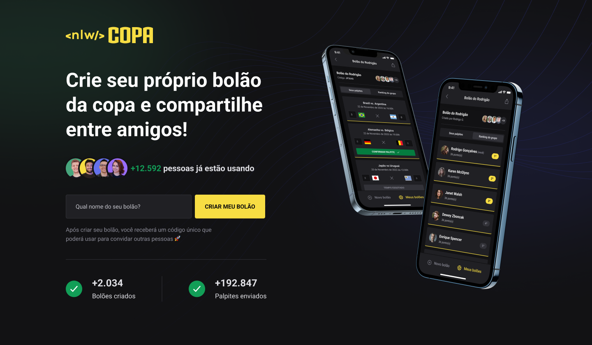

<h1 align="center"> NLW Copa Ignite </h1>

Evento exclusivo e gratuito, promovido pela Rocketseat para ensino de tecnologias WEB.

  <a href="#-tecnologias">Tecnologias</a>&nbsp;&nbsp;&nbsp;|&nbsp;&nbsp;&nbsp;
  <a href="#-projeto">Projeto</a>&nbsp;&nbsp;&nbsp;|&nbsp;&nbsp;&nbsp;
  <a href="#-layout">Layout</a>&nbsp;&nbsp;&nbsp;|&nbsp;&nbsp;&nbsp;
  <a href="#memo-licença">Licença</a>

  

 

  

## 🚀 Tecnologias

Esse projeto foi desenvolvido com as seguintes tecnologias:

- [React](https://pt-br.reactjs.org/)
- [Next.js](https://nextjs.org/)
- [React Native](https://reactnative.dev/)
- [Native Base](https://nativebase.io/)
- [TypeScript](https://www.typescriptlang.org/)
- [Expo](https://expo.dev/)
- [Expo Go](https://expo.dev/client)
- [TailwindCSS](https://tailwindcss.com/)
- [Prisma](https://www.prisma.io/)
- [Node e NPM](https://nodejs.org/)

## 💻 Projeto

 Um bolão da Copa, uma aplicação completa, web e mobile, pra garantir a diversão da família e dos amigos durante os jogos. O projeto visa o desenvolvimento de uma plataforma para que o usuários possam criar bolões para a copa do mundo de 2022. A aplicação WEB é uma interface simples e direta, permitindo o usuário conhecer o projeto e criar os seus bolões. Já a aplicação mobile desempenha as demais funcionalidades, como por exemplo, participar de bolões, realizar palpites, compartilhamento de bolões, entre outros.

## 🔖 Layout

Você pode visualizar o layout do projeto através [DESSE LINK](https://www.figma.com/file/39pjafPWhhyPBBAgoYNv9f/Bol%C3%A3o-da-Copa-(Community)?node-id=316%3A2316). É necessário ter conta no [Figma](https://figma.com) para acessá-lo.

## :memo: Licença

Esse projeto está sob a licença MIT.

---

Feito com ♥ por mim junto com a Rocketseat :wave: 

